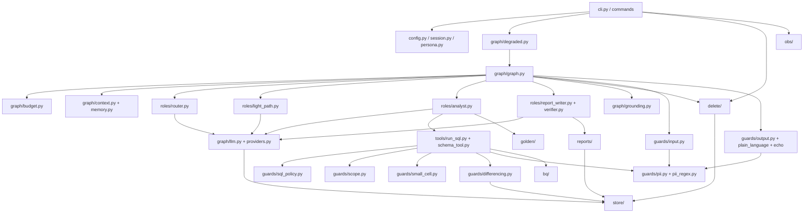

# OpsFleet Data Agent

> The full README (setup, usage, evals, dropped items) is written in iteration 43. This file
> currently holds only the dev-only local model section.

## Documentation

| Document | What it covers |
|---|---|
| [docs/architecture.md](docs/architecture.md) | Production HLD: components, data flow, security, PII, cost, scaling, ADR summaries |
| [docs/technical.md](docs/technical.md) | Technical description of the built prototype, taken from the code: module map, one turn end to end, SQL checks, delete, stores, evals, deviations from the HLD |
| [docs/decisions.md](docs/decisions.md) | Architecture decision records (ADR-001 onwards) |
| [docs/data-model.md](docs/data-model.md) | The `thelook_ecommerce` tables the agent uses |
| [docs/process/](docs/process/) | SDLC artifacts: requirements, design reviews, plan, per-iteration decisions, [owner queue](docs/process/OWNER-QUEUE.md) |

### Module map

Arrows point from a module to the modules it calls (details in [technical.md §1–2](docs/technical.md)).




## Local model (LM Studio, dev only)

Gemini is the default and the only provider used for evaluation. For development you can run
the CLI against a local model served by [LM Studio](https://lmstudio.ai) through its
OpenAI-compatible API, so you do not spend the Gemini free-tier quota (D-143, ADR-015). If you
never set `OPSFLEET_LLM_PROVIDER`, nothing changes. Everything local is test-only: there is no
fallback between LM Studio and Gemini in either direction.

1. In LM Studio, download and load a chat model and an embedding model, then start the local
   server (default `http://127.0.0.1:1234/v1`). The defaults in `config/models.yaml` are:

   ```yaml
   local:
     chat_model: qwen/qwen3.8-27b
     embedding_model: text-embedding-nomic-embed-text-v1.5
     embedding_dim: 768
   ```

   Any chat model with tool calling works; set its id exactly as LM Studio lists it
   (`curl http://127.0.0.1:1234/v1/models`). The embedding model must return vectors of
   length `local.embedding_dim` (768 for nomic-embed-text v1.5); change it together with the
   embedding model.
2. Run the CLI with the local provider:

   ```sh
   export OPSFLEET_LLM_PROVIDER=lmstudio
   # optional, default http://127.0.0.1:1234/v1 (IPv4 loopback; avoids IPv6 localhost issues on macOS)
   export OPSFLEET_LLM_BASE_URL=http://127.0.0.1:1234/v1
   uv run opsfleet-agent --user <profile>
   ```

What changes under `lmstudio`:

- `GEMINI_API_KEY` is not required. `GOOGLE_CLOUD_PROJECT` and ADC are still required, because
  queries still run on BigQuery.
- Every agent role (router, analysts, report writer, verifier, ...) uses `local.chat_model`.
  There is no fallback model and no free-tier rate limiter. The eval judge is not switched:
  `evals/judge.py` stays Gemini-only.
- The startup check calls `GET <base_url>/models` instead of the Gemini model list. If a
  configured model is not loaded, the error lists the ids LM Studio reports, so you can copy the
  right one into `config/models.yaml`. If the server is down you get
  `LM Studio is not reachable at <url>; start the server and load <model>.`
- Reasoning output (`<think>...</think>` or a separate `reasoning_content` field) is removed
  before it reaches any parser or the screen.
- Golden-example vectors are cached in `<data dir>/lmstudio/`, separate from the Gemini cache,
  so the two embedding models never mix. The app database (`app.db`), checkpoints and traces are
  shared between providers.

Answer quality, latency and tool-calling reliability depend on the local model. Eval results and
the deliverable are measured on Gemini only. To check your setup, run the live smoke test:
`OPSFLEET_LLM_PROVIDER=lmstudio uv run pytest -m live tests/live/test_lmstudio_smoke.py -q`.

## Observability with Langfuse (optional)

Each CLI turn can be sent to a self-hosted [Langfuse](https://langfuse.com) as one trace: the
router decision and input guard, the quick or deep analyst steps, every LLM call (masked prompt,
output, tokens, latency, numbered retry attempts), tool calls with sanitized SQL, and the
grounding and output guard verdicts. It is off unless all three variables are set in the root
`.env` (or the environment):

```sh
LANGFUSE_PUBLIC_KEY=pk-lf-your-public-key
LANGFUSE_SECRET_KEY=sk-lf-your-secret-key
LANGFUSE_HOST=http://localhost:3000   # LANGFUSE_BASE_URL is accepted too
```

Tracing is fail-open: if Langfuse is down or misconfigured, the CLI answers as usual and the
sink switches itself off. Traces are flushed on exit, waiting at most 5 seconds. `/trace` prints
the Langfuse trace id and link of the turn. PII and secrets are masked in code before anything
leaves the process; result rows, tool results, pending actions and delete proofs are never sent.
It works the same with `OPSFLEET_LLM_PROVIDER=lmstudio`.

To run Langfuse locally with Docker, see [infra/langfuse/README.md](infra/langfuse/README.md).
That README also shows how to upload the golden eval cases as a Langfuse dataset and run them live (`evals/langfuse_dataset.py upload` / `run`).

Golden eval cases run once per profile (`analyst_a`, `analyst_b`, `ceo_demo`), with scope invariants checked in code for each run. `uv run python evals/run.py --offline --profile ceo_demo` keeps one profile, and the summary prints a case x profile matrix (`docs/process/iter-d160-ods.md`).
Design and the exact list of fields sent: [docs/process/iter40-ods.md](docs/process/iter40-ods.md).
