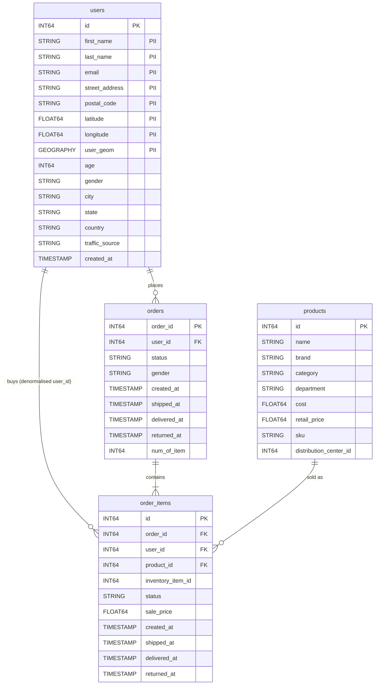

# Data model: `bigquery-public-data.thelook_ecommerce`

Checked via `INFORMATION_SCHEMA` and counts on 2026-10-04. The agent uses only these four tables.

| Table | Rows | Notes |
|---|---|---|
| `users` | 100,000 | The only table with PII |
| `orders` | 124,966 | Order header; **no product column** |
| `order_items` | 181,033 | The only link to products; revenue = `sum(sale_price)` |
| `products` | 29,120 | 26 categories, 2 departments (Women, Men), 2,756 brands |

- **Statuses** (orders and items): Complete, Shipped, Processing, Cancelled, Returned.
- **Order dates:** 2019-01-12 .. today (the dataset is refreshed regularly, so "last month" has real data).
- **Product scope:** product data reaches orders and customers only through `order_items.product_id`. A scoped query therefore always goes `order_items ⋈ products` filtered by the user's scope (a brand list or the CEO `all` flag), and customer and order metrics are computed from those in-scope items.
- **Categories:** Accessories, Active, Blazers & Jackets, Clothing Sets, Dresses, Fashion Hoodies & Sweatshirts, Intimates, Jeans, Jumpsuits & Rompers, Leggings, Maternity, Outerwear & Coats, Pants, Pants & Capris, Plus, Shorts, Skirts, Sleep & Lounge, Socks, Socks & Hosiery, Suits, Suits & Sport Coats, Sweaters, Swim, Tops & Tees, Underwear.
