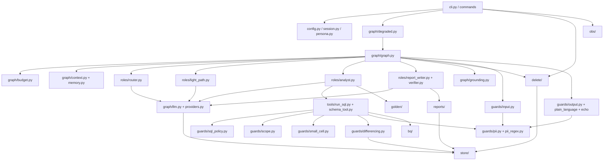

# OpsFleet Data Agent: Technical Description

This document describes the prototype **as built** on branch `step5-implementation`.
- `docs/architecture.md` (the HLD) says what the system should be and why.
- This document says where each part lives in the code, how one turn flows through it, which decisions changed the design during Step 5 and why, and where the code differs from the HLD.

Anchors are `path:line` in `src/opsfleet_agent/` unless another path is given. They were checked against the code at the time of writing; line numbers drift, so search for the symbol if one is off.

Contents:
1. Module map
2. Module dependencies
3. One turn, end to end
4. The SQL path: order of checks
5. Two-phase delete
6. Stores
7. Evals and CI
8. Decision digest: what changed in Step 5, and why
9. Implemented vs designed but not built
10. Deviations from the HLD
11. Open items

---

## 1. Module map

### 1.1 Entry, configuration, session

| Module | Responsibility | Key symbols | Tests (examples) |
|---|---|---|---|
| `__main__.py`, `cli.py` | REPL, startup sequence, wiring of runtime pieces, Ctrl-C handling, terminal-safe output | `build_runtime` `cli.py:241`, `_install_pii_detector` :154, `wire_delete` :224, `_resume_precheck` :335, `_Repl` :362, `main` :560 (Ctrl-C → exit 130, other errors → exit 2); constants `MAX_TURNS=1000`, `MAX_INPUT_CHARS=8000`, `CANCEL_BOUND_S=1.0`, `LANGFUSE_FLUSH_BOUND_S=5.0` | `tests/unit/test_cli*.py` |
| `cli_progress.py` | TTY-only spinner with fixed labels, erased before output and on Ctrl-C (D-147) | `Spinner` :79 | `test_cli_progress*.py` |
| `config.py` | Settings from env, `.env` and `config/models.yaml`; provider selection (Gemini or LM Studio); startup check | `Settings` :66, `load_settings` :278, `startup_check` :374, `QUOTA_DEFAULTS` :190, `PROVIDERS` :40 | `test_config*.py` |
| `session.py` | Demo profiles (brand scope or the explicit `all` flag), session object, local-mode startup check | `Profile` :29, `Session` :43, `load_profiles` :109, `local_startup_check` :194 | `test_session*.py` |
| `persona.py` | Persona file parsing and prompt assembly; a fixed safety preamble always comes first | `parse_persona` :132, `PersonaStore` :183, `assemble_prompt` :238, `SAFETY_PREAMBLE` :45 | `test_persona*.py` |
| `commands/` | Slash commands. The REPL exposes `/help`, `/exit`, `/feedback`, `/trace`, `/audit`, `/persona` (read-only), `/reports`, `/open` and `/search`. `wire_delete` registers `/delete` at runtime. `/export` is a stub. `commands/triage.py` is a separate maintainer CLI (`python -m opsfleet_agent.commands.triage`, iteration 36) for feedback triage; `commands/erase.py` (iteration 35) is the maintainer erasure CLI, `/erase` in the REPL only explains it | `COMMANDS` `commands/__init__.py:266`, `dispatch` :284; `root_cause`, `Triage`, `main` in `commands/triage.py`; `access_set` `commands/access.py:197` and `apply_persona` / `rollback_persona` `commands/persona.py:247/:325` are admin APIs, audit-first, **not wired to the REPL** | `test_commands*.py` |

### 1.2 Graph (code supervisor)

| Module | Responsibility | Key symbols |
|---|---|---|
| `graph/graph.py` | The parent LangGraph graph, its nodes and pending-state handling (save, delete, owner checks). The checkpointer is an encrypted `SqliteSaver` at `checkpoints.db`. The thread id is the session id, with `durability="sync"` | `build_checkpointer` :261, `build_run_sql_tool` :293, `TurnState` :333, `GraphServices` :397, `_make_nodes` :706, `_build_report` :1189 (the verifier runs here, not in its own node), `_finalize` :1470, `AgentGraph` :1673 (`run_turn` :1705, `_run` :1723), `PendingTurn` :1990 |
| `graph/budget.py` | Per-turn caps and the recursion guard | `TURN_CAPS` :44 (QA 10 LLM / 6 SQL / 120 s; REPORT 14 / 6 / 180 s; LIGHT 3 / 0 / 120 s), `TurnBudget` :151, `run_with_recursion_guard` :311, `RECURSION_LIMIT=60`, `ROLE_SUBCAP=6`, `MAX_TURN_RETRIES=6` :24 |
| `graph/llm.py` | The single call wrapper (retry with backoff, error classification, token bucket) | `LLMWrapper` :162, `TokenBucket` :102, `classify_error` :57, `BACKOFFS_S` :28 |
| `graph/providers.py` | Chat model per provider; local provider (LM Studio) with no deadline (D-149); strips reasoning blocks | `chat_model_for` :241, `LocalChatModel` :157, `is_local` :58, `strip_reasoning` :67 |
| `graph/context.py` | Context assembly: history window, store items and the prior-query ledger. Everything rendered is scrubbed and fenced as untrusted. Budget is 64k chars | `assemble_context` :701, `fence_untrusted` :300, `needs_clarification` :583 |
| `graph/memory.py` | Session memory in checkpoint state (churn definition, preference notes, one pending clarification), re-validated on load | `SessionMemory` :262 |
| `graph/grounding.py` | Every figure in the answer must come from a tool result (relative tolerance 0.5%) | `check_grounding` :551 |
| `graph/intents.py` | Code-level intent checks that override or back up the router | `is_sql_request` :98, `is_customer_ranking_request` :167, `asks_for_customer_pii` :176, `CUSTOMER_BANDS_NOTICE` :110 |
| `graph/fixed_replies.py` | Markers that replace code-owned replies in LLM history (D-156) | marker :99 |
| `graph/assumptions.py` | "Assumptions" footer on answers | `assumptions_footer` :83 |
| `graph/degraded.py` | LLM health and quota gate; degraded mode keeps commands working when the LLM is down (D-137) | `LLMHealth` :103 (`wrap` :139), `DegradedGraph` :153 |
| `graph/resume.py` | `--resume` and closing of a Ctrl-C-interrupted turn | `resume_turn` :104, `close_interrupted_turn` :161 |

### 1.3 Roles

| Module | Role | Key symbols |
|---|---|---|
| `roles/router.py` | Classifies the current user message into 10 labels. Output must have exactly the keys `{label, is_english, refusal_text}`. A failure fails open to `complex` (the full, guarded path) | `LABELS` :58, `LIGHT_LABELS` :72, `FULL_LABELS` :73, `FAIL_OPEN_LABEL` :74, `route` :297 |
| `roles/analyst.py` | Quick and Deep analyst. One LangGraph subgraph with tools. It escalates from Quick to Deep after 2 failed SQL runs or 4 calls (`[[ESCALATE]]`) | `build_analyst_graph` :385, `run_analyst` :483, `TOOL_SPECS` :121 |
| `roles/light_path.py` | Smalltalk and meta replies: no tools, no data, one call. A reply that contains a figure is replaced by a template | `run_light_path` :129 |
| `roles/report_writer.py` | Report draft: at most 3 writer calls and 2 verifier calls, plus a code fallback draft | `produce_report` :211, `fallback_draft` :163 |
| `roles/verifier.py` | A code precheck, then an LLM verification of the draft against tool results | `precheck` :66, `verify_report` :108 |
| `roles/library_agent.py` | Library agent (iteration 46) for `library` turns, on flash-lite: list, search, view, rename, export, delete preview and set_preference. No SQL or schema tool is in its tool set (checked at import), `delete_reports` only produces the preview that the user confirms on the next turn, and a failure gives a template, never the analyst | `LIBRARY_TOOL_SPECS` :122, `make_library_executors` :295, `build_library_graph` :450, `run_library_agent` :529 |

There are 5 LLM roles plus the light path, as in ADR-009.

### 1.4 Guards

| Module | Stops | Key symbols |
|---|---|---|
| `guards/input.py` | Overlong input (4000 chars), typed PII (masked before anything stores or routes it), injection patterns (per line, after folding look-alikes) | `check_input` :512 |
| `guards/pii_regex.py` | Regex PII scrubber: email, phone, card, id, with Unicode folding | `scrub` :367 |
| `guards/pii.py` | Presidio with spaCy NER after the regex stage. The allowlist covers schema terms, report headings, scope brands, catalogue categories and departments | `SCHEMA_TERMS` :277, `REPORT_TERMS` :290, `CATALOGUE_CATEGORIES` :301, `CATALOGUE_DEPARTMENTS` :308, `scrub_output` :967; `MIN_SCORE` 0.5, `NER_SCORE` 0.85 |
| `guards/sql_policy.py` | sqlglot AST policy that fails closed. 25 rules: SELECT only, allowed tables, no PII columns, quasi-identifier rules, no `SELECT *`, no UNNEST, no QI inside counting aggregates. Size caps: 8000 chars, 5000 nodes, depth 120 | `check_sql` :509, `Rule` :288, `ALLOWED_TABLES` :166, `PII_COLUMNS` :197, `QI_COLUMNS` :209, `aggregate_only_plan` :547, `check_aggregate_only` :579 |
| `guards/scope.py`, `scope_ctes.py` | Brand scope: AST rewrite of every table reference into code-built, PII-free CTEs (`__p`, `__oi`, `__o`, `__u`) filtered by the bound parameter `@scope_brands`, plus a post-rewrite invariant check | `apply_scope` :446, `verify_scoped` :340 |
| `guards/small_cell.py` | Small-cell rule for customer quasi-identifier breakdowns (k = 5) | `apply_small_cell` :179 |
| `guards/differencing.py` | Differencing attacks across queries, per session and per user across sessions (fingerprints kept 30 days) | `DifferencingGuard` :490 (`prepare` :532, `release` :616) |
| `guards/output.py` | Output allowlist per role, injection scan (blocks the whole answer), exact-value PII masking | `check_output` :365, `ROLE_TOOLS` :149 |
| `guards/plain_language.py` | No SQL in chat (D-151a); schema identifiers become business words (D-151) | `strip_sql` :386, `humanize_identifiers` :294 |
| `guards/echo.py` | An answer that repeats an earlier reply or static text is rejected (D-156), similarity ≥ 0.9 | `is_echo` :54 |

### 1.5 Tools, BigQuery, reports, delete, stores, golden, observability

| Module | Responsibility | Key symbols |
|---|---|---|
| `tools/run_sql.py` | The only path from a model to BigQuery. Runs every guard in order (§4) | `RunSqlTool` :723 (`run` :763, `_pipeline` :818, `_scrub_rows` :554, `_merge_small_bands` :594, `_cap` :716), `MAX_ROWS=200` |
| `tools/schema_tool.py`, `tools/registry.py` | Schema description with PII columns hidden; tool registry | — |
| `bq/client.py` | `WarehouseClient` protocol and `BigQueryRunner`: mandatory dry run, `maximum_bytes_billed`, 1 GB per query, 10 GB per session, 60 s, 200 rows | `BigQueryRunner` :267 (`prepare` :304, `execute` :335) |
| `bq/errors.py`, `bq/memo.py`, `bq/schema.py` | Error classification (raw error text is inspected, never kept), memo keyed after the scope rewrite, table metadata cache | `ErrorCode` :31, `run_memoised` :131, `TableMetadataCache` |
| `reports/` | Report schema and required sections, matcher for `/open`, `/search` and delete selectors, library listing with `R-` display ids | `ReportDraft` `schema.py:104`, `REQUIRED_SECTIONS` :55, `draft_hash` :383, `match_reports` `matcher.py:106`, `delete_candidates` :120, `DISPLAY_PREFIX` `library.py:74`, `open_report` :291 |
| `delete/` | Two-phase delete (§5) | `DeleteKey` `token.py:56`, `derive_token` :100, `verify_proof` :128; `DeleteService` `flow.py:273`, `parse_delete_request` :188, `setup_delete` :699 |
| `store/` | SQLite stores (§6) | `connect` `db.py:48`, `MIGRATIONS` :22, `AuditLog` `audit.py:550`, `audited_delete` :971, `ReportStore` `reports.py:112`, `QuotaStore` `quota.py:43` |
| `golden/` | Golden Bucket seed index: top-k = 3, min score 0.6, lexical fallback 0.2; strict mode via `OPSFLEET_GOLDEN_STRICT` | `GoldenIndex` `seed.py:485`, `build_golden_index` `runtime.py:47` |
| `obs/` | JSONL tracer with masking and secret registration; optional Langfuse sink (fail-open); metrics; progress hook | `Tracer` `tracer.py:271`, `scrub_text` :143, `register_secret` :127, `LangfuseSink` `langfuse_sink.py:230`, `build_sink` :525 |

### 1.6 Outside `src/`

| Path | Holds |
|---|---|
| `config/models.yaml` | Model ids per role, limits, `small_cell_k: 5`, quotas, local-provider settings. It also lists a `summary` role, which no code uses |
| `config/profiles.yaml` | Demo profiles: `analyst_a` (one brand), `analyst_b` (two brands), `ceo_demo` (`all`) |
| `config/golden_seed.yaml` | Golden Bucket seed |
| `prompts/` | `analyst.md`, `router.md`, `report_writer.md`, `persona.md` (versioned in-file: analyst-v4, router-v3, report-writer-v1) |
| `evals/` | Runner, live SUT, gates, judge, profile matrix, Langfuse dataset tool, case folders (§7) |
| `tests/unit/`, `tests/live/` | Offline unit tests (no network) and `@pytest.mark.live` tests |

## 2. Module dependencies

Arrows point from caller to callee. Guards and stores depend on nothing above them.

`store/quota.py` sits behind `graph/degraded.py`, and `store/audit.py` is used by delete, commands and the admin APIs.

## 3. One turn, end to end

1. **Startup** (`cli.py:578` `_main`). Steps, in order:
   - Load profiles and settings.
   - Run the checks.
   - Build the encrypted checkpointer and the session.
   - Run the resume precheck, which refuses an unknown session, another user's session or an undecryptable checkpoint, before any network call.
   - Run `startup_check`.
   - Install the PII detector, with the allowlist built from the scope brands and the catalogue.
   - Build the runtime, `DegradedGraph(AgentGraph)`.
   - A failed step stops startup with one actionable line.
2. **REPL** (`_Repl` :362).
   - The input is cleaned first.
   - A `/command` goes to `dispatch` and never reaches the graph.
   - Any other text gets `turn_id = uuid4().hex[:12]`.
3. **Guarded call.** A SIGINT handler, the spinner and the Langfuse span wrap the turn.
4. **`DegradedGraph.run_turn`** (`graph/degraded.py:153`).
   - `LLMHealth.wrap` checks the per-user quota.
   - A quota store failure refuses the call (D-148).
   - Delete confirm, cancel and execute are never gated.
5. **`AgentGraph._run`** (`graph/graph.py:1723`). Pending state is resolved before the graph runs, in this order:
   1. owner check (a non-owner gets the same text as an unknown session, D-123);
   2. sticky `aggregate_only` flag;
   3. a stranded delete;
   4. a delete confirmation;
   5. a save confirmation (Save / Revise / Cancel);
   6. "save this";
   7. a parsed delete request.
6. **Graph invoke.**
   - Main path: `START → input_guard → (light | load_context) → quick ⇄ deep → force_answer → grounding → report_writer → confirm_save → finalize`.
   - Delete path: `delete_preview → confirm_delete → execute_delete`.
   - `input_guard` runs `check_input` and then the router. Light labels go to `light`, the rest to `load_context`.
   - The analyst calls `run_sql` (§4).
   - `force_answer` writes an answer from what is already known when the budget runs out.
   - `grounding` rejects figures that do not appear in tool results.
   - `finalize` runs the output guard, `strip_sql`, `humanize_identifiers`, the echo check and the assumptions footer.
7. **Output.** `_result → show`. Before printing, `terminal_safe` strips control, bidi and zero-width characters.

**Ctrl-C.**
- The turn is cancelled, with a 1 s bound.
- `close_interrupted_turn` marks the turn closed in the checkpoint, and the span is recorded.
- The user sees `CANCELLED_TEXT`.
- A delete that was confirmed but not executed never runs on a later turn (22a MJ-1).

**Bounds.**
- Every loop has a cap: `TurnBudget` sets LLM calls, SQL calls and wall time per turn type, and `RECURSION_LIMIT=60` applies to the graph.
- Every retry has a cap: the call wrapper backoffs and the writer/verifier caps.
- The local provider has no deadline (D-149).

## 4. The SQL path: order of checks

`RunSqlTool._pipeline` (`tools/run_sql.py:701`) runs the steps below in this order. Any refusal returns a typed error to the model, and no rows are sent.

1. **Parse** with sqlglot, within the size caps (8000 chars, 5000 nodes, depth 120). A parse failure is a refusal.
2. **Turn-level refusals.** The turn is flagged `aggregate_only` (customer-ranking turns, sticky for the session, D-162), so `check_aggregate_only` refuses id-grain SQL.
3. **Policy** (`check_sql`): the 25 rules. A disallowed source returns a fixed hint listing the allowed tables (D-154).
4. **Scope rewrite** (`apply_scope`). Table references are replaced by scoped CTEs with `@scope_brands` bound as a parameter (D-32); the `all` flag skips the filter.
5. **Small-cell** (`apply_small_cell`, k = 5) for customer quasi-identifier breakdowns. This step injects count columns where needed.
6. **Population query** for quasi-identifier filters on customer-level lists.
7. **Differencing prepare** (`DifferencingGuard.prepare`). The fingerprint is checked against the session and the user's history.
8. **Invariant** (`verify_scoped`). The rewritten SQL is checked again; failure is fatal.
9. **Memo → dry run → execute** (`BigQueryRunner.prepare` / `execute`). The dry run is mandatory, with `maximum_bytes_billed` and the per-session byte budget. Then **differencing release** runs, and a plan is abandoned in `finally` on every other path.
10. **Rows.**
    - Injected count columns are dropped.
    - PII in values is scrubbed.
    - Spend bands with fewer than 5 customers are merged together (and with the smallest large band if still too small), or hidden when bands may overlap or are not named by fixed labels (D-163, D-172).
    - The result is capped at 200 rows.
11. **Accounting.** Bytes, ledger and trace spans are recorded, and a typed envelope is returned to the model.

Why this order:
- Scope is applied before the small-cell and differencing checks. Both are about what one user's scope can reveal (FR-69), so they must see the scoped query.
- The memo key is computed after the rewrite, so two scopes never share a cached result (ADR-012).

## 5. Two-phase delete

Code: `delete/flow.py`, `delete/token.py`, `store/audit.py:971`. This is a 🔴 area.

1. **Parse.** `parse_delete_request` uses a strict grammar: the verb comes first, negations are refused, "report(s)" must end the request or be followed by a selector (D-146), and `R-<id>` is accepted (D-166).
2. **Preview** (`DeleteService.preview` :342). It finds candidates owned by the user within scope. Nothing found, more than 100 matches or a store error ends it here; the preview shows 20.
3. **Stage** (:372). It creates a pending action id with a 600 s expiry. Only `token_sha256` goes into the checkpoint. It writes `delete.previewed` and shows the confirm prompt.
4. **Confirm** (:475). The token is re-derived as an HMAC over the action, the ids, the owner, the session, the turn and the expiry, using an in-memory key. Nine checks run in order:
   - `declined`
   - `wrong_action`
   - `replayed`
   - `wrong_owner`
   - `timeout`
   - `wrong_turn`
   - `set_changed`
   - `key_changed`
   - `proof_mismatch`

   It then writes `delete.confirmed`. **Confirm never deletes.**
5. **Execute** (:577). It requires the committed confirm row within a 60 s grace. If any previewed report vanished, nothing is deleted and the user is asked again (OD-14); a subset is never deleted.
6. **`audited_delete`** runs as one transaction:
   1. `BEGIN IMMEDIATE`
   2. verify the kind
   3. **INSERT `delete.executed` first**
   4. count the rows
   5. `DELETE`
   6. re-check
   7. `COMMIT`

   An audit failure rolls back, so nothing is deleted. Triggers on the audit table block UPDATE and DELETE.
7. **Abandon, stranded, restart.**
   - Ctrl-C produces a `CANCELLED interrupted` record.
   - A stranded delete is closed on the next turn.
   - A restart loses the key, so every pending delete expires and fails safe (OD-10).

Why an HMAC instead of a stored token (ADR-007):
- Nothing secret is stored or checkpointed.
- A replayed or forged confirmation fails.
- There is no vault dependency.

The delete tool is **not exposed to the model**. Only the user's own text or `/delete` starts a delete.

## 6. Stores

The prototype uses SQLite. `store/db.py:48` opens it in WAL mode with `secure_delete` and file mode 0600.

| File | Table | Written by | Notes |
|---|---|---|---|
| `app.db` | `schema_migrations`, `meta` | migrations v1 | |
| | `audit_event` | `AuditLog` (v2) | append-only (triggers block UPDATE and DELETE); audit-first |
| | `saved_report` | `ReportStore.save` (v3) | idempotent, guarded and scrubbed, author-only |
| | `user_quota` | `QuotaStore` (v4) | per-user LLM call quotas (D-138) |
| | `report_fts` (FTS5) | `ReportStore.save`/`rename`, `audited_delete` (v5) | ranked `/search` (iteration 37); kept in sync by code, no triggers; `secure-delete` plus `optimize` on delete (D-199, D-200) |
| | `report_vector` | `ReportStore.save`/`rename` after the commit, lazy backfill on search, `audited_delete` (v6) | hybrid `/search` (iteration 38): one float32 embedding per report with model, dims and content hash; owner column; a plain counted delete dependent (D-209..D-214) |
| | `feedback` | `store/feedback.py` | `/feedback`; table created by `ensure_schema`, outside `MIGRATIONS` |
| | `aggregate_fingerprint` | `store/fingerprints.py` | HMAC digests, `RETENTION_DAYS=30`, per user; created by `ensure_schema` |
| `checkpoints.db` | LangGraph checkpoints | `build_checkpointer` | AES-encrypted serde; thread id = session id |

## 7. Evals and CI

- **Runner.** `evals/run.py` (`main` :597) runs cases offline from recorded fixtures (`recorded_harness` :140) or live (`evals/live_sut.py`, `live_harness` :396).
  - Before a live run it estimates the requests and refuses a run that would use more than 75% of the daily quota.
  - Each case runs in a fresh session, with its own data dir `data/eval-live`.
- **Cases.**
  - `evals/cases/golden`: 41 cases.
  - `evals/cases/router`: 71 cases.
  - `evals/cases/adversarial`: injection (1) and `pii_typed` (5).
  - `_fixtures`: used only for the offline CI run.
- **Profile matrix** (D-160). Golden cases run under `analyst_a`, `analyst_b` and `ceo_demo`, with scope invariants checked in code on every run; opt-outs carry a reason.
- **Gates** (`evals/gates.py:81`).
  - Golden ≥ 80%. An uncalibrated judge fails this gate.
  - Adversarial 100%.
  - `pii_typed` recall ≥ 95%, with 0 brand false positives.
  - Resilience 100%.
- **Judge** (`evals/judge.py`). A score ≥ 4 passes. Calibration needs ≥ 0.80 agreement over ≥ 30 owner-labelled cases (`evals/calibration/`, D-107/D-108).
- **Langfuse.** `evals/langfuse_dataset.py upload|run` manages the dataset `opsfleet-golden` (D-158).
- **CI.** `.github/workflows/ci.yml` runs on push and PR:
  - `uv sync --frozen`
  - ruff
  - pytest with `OPSFLEET_GOLDEN_STRICT=1`
  - the offline eval on `evals/cases/_fixtures`
  - a check that `requirements.txt` matches `uv.lock`

  Live evals are run by hand, with the owner's agreement.

## 8. Decision digest: what changed in Step 5, and why

Full rows are in `docs/process/OWNER-QUEUE.md` and the ADRs are in `docs/decisions.md`. Only the decisions that shape the code are listed here.

### PII
| Decision | What | Why |
|---|---|---|
| D-9 / D-13 / D-48 | Typed mask tokens (`<EMAIL>`, `<PHONE>`, `<CARD>`, `<ID>`), not `[REDACTED]` | The HLD §5.4 format. The answer still tells the user what kind of value was removed. The ACs are to be aligned |
| D-153, D-167, D-171 | Scope brands, catalogue categories and departments, and analytical headings ("Takeaways", "Summary") are in every NER allowlist | spaCy tagged "Swim" and "Takeaways:" as PERSON. The masked word then leaked into later turns. Real names next to these words are still masked |
| D-151 / D-151a | Answers use plain business words, and SQL is never shown, even on request | The users are business users. Showing SQL also exposes schema and policy details |
| D-156 | Code-owned replies become markers in LLM history; echoed answers are rejected | In a batch run the model repeated the capabilities text in place of answering |

### SQL policy and scope
| Decision | What | Why |
|---|---|---|
| D-28 | UNNEST is refused | It can widen a scoped source; the HLD was fixed to match |
| D-32 | The brand list is a bound parameter `@scope_brands`, and `scope_key` is part of the memo and cache keys | The SQL text is then the same for every scope, so the cache key must carry the scope. Binding the list also avoids literal injection |
| D-42 | `users.created_at` is allowed under MONTH, QUARTER or YEAR truncation | Cohort questions need it, and these grains do not single out a person |
| D-45 | Quasi-identifier expressions inside counting aggregates (for example COUNTIF) are refused | Otherwise a conditional count gets around the small-cell rule |
| D-154 | A disallowed source returns a fixed hint with the allowed tables | The model recovers in one step and does not burn the SQL budget |
| D-165 | Questions about data that does not exist (inventory, ad spend, web visits) are routed by the router alone | An English regex override was brittle. The analyst says the data is missing and offers proxies |

### Customer rankings (spend bands)
| Decision | What | Why |
|---|---|---|
| D-157 → D-159 | "Top customers" is answered with spend bands and customer counts, never individual customers or ids | Ranking by id at customer grain is re-identifying. The guard is code (`check_aggregate_only`), not the prompt |
| D-162 | `aggregate_only` stays on for the rest of the session | Otherwise "now show their IDs" in the next turn gets around it |
| D-163 | Each band must hold at least 5 customers, enforced in code | The same k as the small-cell rule |
| D-170 | Aggregate-only mode lasts the whole session | — |
| D-172 | Bands under 5 customers are merged into one row, then with the smallest band of 5 or more if still too small (fixed label `other bands`, counts and sums added, shares and averages empty). Bands that may share customers (`UNION`, a source that is not one row per customer) or are labelled by a raw value are hidden instead; window columns that could reveal them are emptied; `QUALIFY` and row-gating subqueries are refused | Summing counts of overlapping bands could overcount, a raw label would list each customer's value, and an order-dependent partner would let a re-sorted query be subtracted from the first, so the merge is canonical and only for provably disjoint, fixed-name bands |
| D-173 | Once a primary model has used up its retries on provider errors (429, 5xx, timeout), later calls in the same turn that have a fallback go straight to it, once, with no retries (`LLMWrapper._degraded`); a limiter timeout or a budget stop does not count, and the next turn starts on the primary again | Going back to a primary that just failed spent three attempts per round on the same error and ran the analyst out of its sub-cap before the last query; every attempt still counts against the budget |
| D-174 | The analyst prompt states today's UTC date in Scope (`GraphServices.today`, injectable) and analyst-v4 makes relative periods count from it, with a to-date period also bounded above by the day after today. Grounding reads a four-digit number before a period word ("2026 is a partial period", "2026 YTD") as a year | The dataset holds rows dated in the future, so an open-ended "this year" overstated revenue by about 1.6%; and a plain year sentence was flagged as an ungrounded figure and labelled the whole answer an estimate |

### Routing and roles
| Decision | What | Why |
|---|---|---|
| D-155 | 10 router labels (`memory` and `comment` added) | English regex for these intents misfired; the router already sees the message |
| D-164 | A router outage fails open to `complex`, and there is no offline fallback | The full path is guarded in code, so failing open is safe; failing closed would block every turn |
| D-56 | The router sees only the previous user message; after a router retry the light reply is the template | Smaller injection surface, and the light-path call budget is kept |
| D-79 | `report` turns went to the deep analyst until the writer node existed (17); `library` turns did until iteration 46 (D-195..D-198), and now go to the Library agent | The library agent was not built until then |

### Reports
| Decision | What | Why |
|---|---|---|
| D-124 | Strict confirm grammar: only plain-ASCII save/cancel/revise; anything else implicitly cancels and is a new turn | No accidental saves, and no look-alike tricks |
| D-125 | When the verifier cap is hit, the final draft gets only the code precheck and an "unverified" note | Bounded calls, honest labelling |
| D-141 | A revise cut off by the quota midway drops the old draft | Keeping it needs a graph change; accepted for now |
| D-168 | The golden report cases expect `report_pending` and `report_saved` | The cases were wrong, not the graph |

### Delete (🔴)
| Decision | What | Why |
|---|---|---|
| D-80 / D-81 | Deletes go through a code registry of deletable kinds with strict schema rules, not a table argument | No path from text to an arbitrary table, and cascades are declared |
| OD-10 | After a restart, a confirmed but unexecuted delete expires | Fail safe |
| OD-14 | If the set changed, delete nothing and ask again | A subset delete would be something the user did not confirm |
| D-144 to D-146 | Ctrl-C after commit prints "Cancelled." while the audit has the real count; ambiguous phrases are refused | Accepted, safe direction; the CLI text fix is 22b |
| D-166 | `R-<id>` is accepted as well as the bare id | Users copy the id they see |

### LLM providers, quota, degraded mode
| Decision | What | Why |
|---|---|---|
| D-137 | `DegradedGraph` wrapper | Commands such as `/reports`, `/open` and `/search` keep working when the LLM is down |
| D-138 / D-148 | Quotas live in `config/models.yaml`; a failing quota store refuses the call | Fail closed on cost; delete steps are never gated |
| D-143 (ADR-015) | Local provider (LM Studio) alongside Gemini | Development and evals without spending the Gemini quota |
| D-149 / D-150 | No deadline for local models; `reasoning_effort="none"` is a constant | Local models are slow, and the constant suits qwen in LM Studio |

### Evals
| Decision | What | Why |
|---|---|---|
| D-107 / D-108 | 30 owner-labelled calibration cases; agreement measured on pass/fail | A judge that is not calibrated cannot gate a release |
| D-158 / D-160 | Langfuse dataset and live SUT; the profile matrix covers one brand, two brands and CEO | Scope has to hold for every kind of account, not only one |
| D-169 | The live SUT uses the same session-id shape as the CLI | Otherwise live paths skipped the audit |

### ADR drift (to fix in `docs/decisions.md`)
- **ADR-003**: primary → 2 retries (1 s, 2 s plus jitter; D-6) → fallback once, at most 6 retries per turn; after a primary fails, the rest of the turn uses its fallback (D-173) (`BACKOFFS_S` in `graph/llm.py`, `MAX_TURN_RETRIES` in `graph/budget.py`).
- **ADR-009** lists five roles. All five are built; the Library agent came last (iteration 46). It has no `save_report` tool: saving goes only through `confirm_save` (D-198).
- **ADR-010** now has 10 labels; the text was updated for D-155.

## 9. Implemented vs designed but not built

| Area | Built | Designed, not built |
|---|---|---|
| Roles | Router, Quick/Deep analyst, writer, verifier (inside `_build_report`), light path, Library agent (iteration 46) | `summary` role in `models.yaml` unused; the Library agent's `save_report` tool (D-198) |
| Commands | `/help`, `/exit`, `/feedback`, `/trace`, `/audit`, `/persona` (read-only), `/reports`, `/open`, `/search`, `/delete`, `/erase` (info only); erasure as a maintainer CLI (`commands/erase.py`, iteration 35, D-222..D-226) | `/export` (stub), rename, `retry report` (the `RETRY_REPORT` cap exists but is unused); remote (Langfuse) and backup erasure |
| Admin | `access_set`, `apply_persona`, `rollback_persona` as audit-first APIs | REPL wiring for them |
| Feedback triage | Maintainer CLI (iteration 36): `list`, `show`, `classify` (ordered root-cause rules over the turn's spans), `dismiss`, `add-eval` (scrubbed draft case), `promote` (seed validator, PII detector, BigQuery dry run, offline eval, then a Golden candidate file); audit first, compare-and-set state | Auto-flagged failed turns, clustering, automatic merge into `config/golden_seed.yaml` |
| Search | Hybrid `/search` and library-tool default (iteration 38): FTS5 bm25 (iteration 37) fused with embedding cosine by RRF k=60; degrades to bm25, then to the word match; `tag:`, `from:`, `to:` | A vector index or ANN service: the cosine scan is brute force over at most 200 of the owner's reports |
| Stores | Migrations v1–v4, feedback, fingerprints | Sessions and preferences stores (memory lives in checkpoint state); `checkpoint_truncate` has no caller |
| Evals | Golden, router, adversarial injection and `pii_typed`, profile matrix, judge with calibration, Langfuse dataset | Many HLD adversarial and resilience categories have no case files; no golden case uses `numbers` or `reference_sql`; no `run_experiment`; judge is Gemini only |
| CI | ruff, pytest (strict golden), offline eval, requirements sync | gitleaks, live eval job, `workflow_dispatch` |

## 10. Deviations from the HLD

1. **Repository layout.** The HLD §1.3 table predates the code:
   - Commands live in `commands/`, not in `cli.py`.
   - The table lacks `cli_progress`, `session`, `persona`, `commands`, `delete`, `golden` and `reports`.
   - There is no `Warehouse` class; the code has the `WarehouseClient` protocol and `BigQueryRunner`.
   - §1.3 now points here.
2. **Verifier** runs inside `_build_report`, not as its own graph node.
3. **Delete resume** checkpoints only `sha256(token)`, and the confirm re-derives the token. The HLD carries an HMAC proof in `Command(resume=...)`. The security property is the same.
4. **Delete selectors and wording.** The grammar is stricter than the HLD (D-145, D-146) and the confirm wording differs.
5. **Router context.** The router sees only the previous user message (D-56), not the last two turns.
6. **Data model §7.1.**
   - Some entities listed there are not tables (sessions, preferences).
   - `saved_report` has no embedding column.
   - `user_quota` and `aggregate_fingerprint` have different columns from the HLD.
7. **FTS index sync (§6.3.2).** The HLD says the FTS table is "maintained by triggers". The code writes it in the same transaction from `ReportStore.save`/`rename` and from `audited_delete` (`fts_dependents`), because `audited_delete` refuses any DELETE trigger on a table it touches (D-199).

## 11. Open items

- **Product names that begin with a name-like word** are masked by NER (D-171 note). This is a 🔴 PII question for the owner.
- **🔴 iterations awaiting owner review** (committed with `[owner review pending]`): 5–15, 17, 19, 21, 22a, 24, plus the CLI wiring. Nothing merges into `main` without the owner.
- **Remaining plan:**
  - 22b: CLI delete polish.
  - 23: library.
  - 28a/b.
  - 33–39: the "if time" items.
  - 43: ADRs and docs.
  - 44 and 45: the final packaging.
